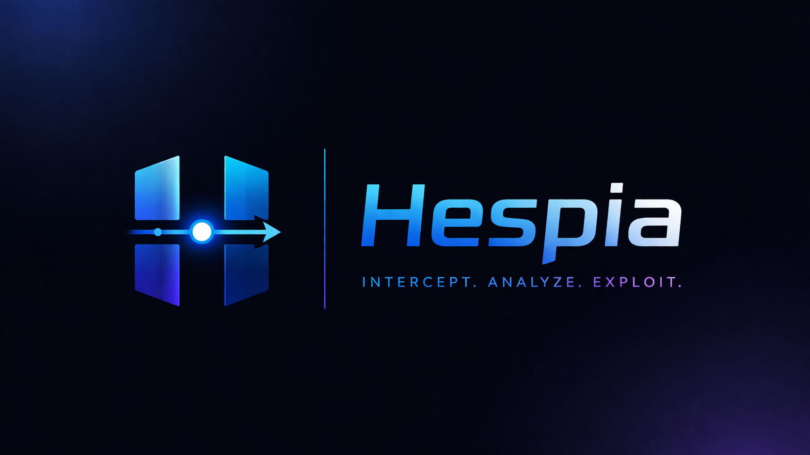

# Hespia Security Suite

<p align="center">
  
</p>

## 🛡️ Hespia: The Advanced Web Security Workbench

Hespia is a high-performance HTTP/HTTPS proxy and security workbench built for reliability and speed. It provides a standalone, specialized environment for intercepting and analyzing traffic, manual payload testing, and large-scale automation.

### 🧪 Core Modules

---

#### 🌐 **Dashboard**
Real-time monitoring and active connection status. No bloat—just the metrics you need to verify your interception is running at zero latency.
``

---

#### 🎯 **Target**
Map your attack surface. Hespia generates hierarchical site trees from live traffic and provides granular scope-limiting to filter out noisy background requests.
``

---

#### 🛑 **Proxy & Intercept**
The primary workbench for real-time traffic manipulation. Freeze requests and responses, edit headers or bodies in-situ, and forward or drop them with a single click.
``

---

#### ⚔️ **Intruder**
Automation without the complexity. Hespia's transformation engine supports **Sniper**, **Battering Ram**, **Pitchfork**, and **Cluster Bomb** attack modes for exhaustive credential and parameter fuzzing.
``

---

#### 🔄 **Repeater**
The standard for manual vulnerability testing. Replay individual requests, modify them on the fly, and track your testing history across isolated tabs. 
``

---

#### 🧪 **Decoder & Comparer**
Toolkit for handling data. Decoder provides multi-stage encoding/decoding (Base64, URL, Hex, HTML), while Comparer offers visual diffing between different sets of requests or responses.
``


---

### 🎨 The Hespia Design System
Hespia was built to solve "Eye Fatigue" during long-haul bug bounties and pentests. 

| Token | Value | Purpose |
| :--- | :--- | :--- |
| **Hespia Orange** | `#ff7d00` | Branding & High-Visibility Action Items |
| **Dark Slate** | `#1e1e1e` | Main background for high-contrast readability |
| **Deep Onyx** | `#181818` | Sidebar and active headers for visual hierarchy |
| **Neutral White** | `#e0e0e0` | Text color optimized for low-light environments |

---

### 📦 Quick Start

1.  **Clone**
    ```bash
    git clone https://github.com/adyanthm/hespia.git
    cd hespia
    ```

2.  **Dependencies**
    ```bash
    pip install -r requirements.txt
    ```

3.  **Run**
    ```bash
    python proxy.py
    ```

### 🏗️ Compiling for your OS
Hespia is built with cross-platform compatibility in mind. You can generate a standalone version of the suite for your specific machine:

*   **Windows**:
    ```powershell
    pyinstaller Hespia.spec
    ```
*   **macOS / Linux**:
    ```bash
    pyinstaller Hespia.spec
    ```
The final binary will be available in the `dist/` directory (labeled `Hespia.exe` on Windows and `Hespia` on Unix).

> [!NOTE]
> **Automated Releases**: This repository uses a GitHub Actions matrix to automatically build and upload binaries for Windows, macOS, and Linux on every push to the `main` branch.

---

*Educational use only. Hespia is an authorized auditing tool; do not use it on systems you do not own or have permission to test.*

<p align="center">
  
</p>
